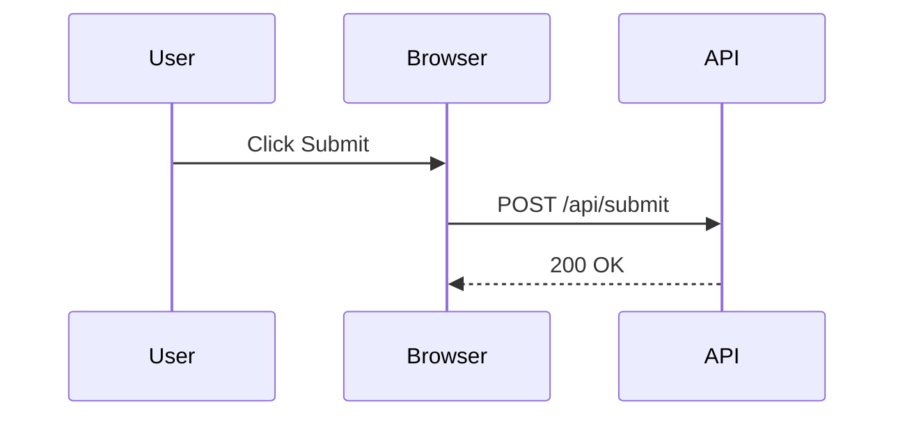

# Journey Recorder Viewer

A React-based web application for viewing and analyzing recorded user journey sessions. This viewer is a companion tool for the [Journey Flow Recorder](https://github.com/mijailpaz/journey-recorder) Chrome extension, providing an interactive interface to replay and analyze recorded sessions.

## Overview

The Journey Recorder Viewer loads three types of files exported by the Chrome extension:
- **Session Video** (`.webm`) - Recorded screen capture of the user session
- **Trace JSON** (`.json`) - Timestamped events including clicks and network requests
- **Sequence Diagram** (`.mmd`) - Mermaid diagram visualizing the user flow

The viewer synchronizes video playback with event markers on an interactive timeline, allowing you to navigate through recorded sessions and understand the relationship between user interactions and network activity.

## Features

- **Video Playback** - Play recorded session videos with standard video controls
- **Interactive Timeline** - Visualize click events and network requests on synchronized timeline tracks
- **Playback Sync** - Red indicator line shows current video position across timeline tracks
- **Click-to-Seek** - Click any timeline marker to jump the video to that moment
- **Sequence Diagram** - View Mermaid sequence diagrams rendered with dark theme
- **File Management** - Load files individually or together, with clear status indicators
- **Modern UI** - Dark theme with polished design using Tailwind CSS

## Tech Stack

- **React 19** - UI framework
- **TypeScript** - Type safety
- **Vite** - Build tool and dev server
- **Tailwind CSS** - Styling
- **Mermaid** - Diagram rendering

## Project Structure

```
journey-recorder-viewer/
├── src/
│   ├── components/
│   │   ├── DiagramPanel.tsx    # Mermaid diagram renderer
│   │   ├── FileInputs.tsx       # File picker components
│   │   ├── FooterBar.tsx        # Status footer
│   │   ├── HeaderBar.tsx        # App header
│   │   ├── Timeline.tsx        # Interactive timeline tracks
│   │   └── VideoPanel.tsx       # Video player component
│   ├── types/
│   │   └── trace.ts             # TypeScript types for trace data
│   ├── App.tsx                  # Main application component
│   ├── main.tsx                 # Application entry point
│   └── index.css                # Global styles
├── public/                       # Static assets
├── dist/                         # Build output
├── package.json
├── vite.config.ts
├── tailwind.config.js
└── tsconfig.json
```

## Prerequisites

- **Node.js** 20.19+ or 22.12+ (recommended)
- **npm** or **yarn**

## Installation

1. Clone the repository:
```bash
git clone <repository-url>
cd journey-recorder-viewer
```

2. Install dependencies:
```bash
npm install
```

## Development

Start the development server:
```bash
npm run dev
```

The app will be available at `http://localhost:5173` (or the port shown in the terminal).

### Development Workflow

1. Start the dev server
2. Open the app in your browser
3. Use the file pickers in the header to load:
   - A `.webm` video file
   - A `.json` trace file
   - A `.mmd` Mermaid diagram file
4. Once all files are loaded, you can:
   - Play the video and watch the red sync line move across the timeline
   - Click timeline markers to seek the video to specific events
   - Hover over markers to see event details

## Building for Production

Build the application:
```bash
npm run build
```

The production build will be output to the `dist/` directory.

Preview the production build:
```bash
npm run preview
```

## Usage

### Loading Files

1. **Load Session Video**: Click "Choose file" under "Session Video (.webm)" and select your exported video file
2. **Load Trace JSON**: Click "Choose file" under "Trace JSON" and select your exported trace file
3. **Load Sequence Diagram**: Click "Choose file" under "Sequence Diagram (.mmd)" and select your exported Mermaid diagram

Files can be loaded in any order. The status bar at the bottom shows the current state:
- "Waiting for files" - No files loaded
- "Waiting for remaining files" - Some files loaded
- "Files loaded – ready to replay" - All files loaded

### Interacting with the Timeline

- **Playback Sync**: As the video plays, a thin red line moves across both timeline tracks showing the current playback position
- **Click to Seek**: Click any yellow (click event) or blue (network request) marker on the timeline to jump the video to that moment
- **Hover for Details**: Hover over any marker to see detailed information about that event

### Timeline Tracks

- **Click Events** (Yellow markers): User interactions like button clicks, link clicks, etc.
- **Network Requests** (Blue markers): HTTP requests made during the session

## File Format Reference

### Trace JSON Format

The trace JSON file should follow this structure:

```json
{
  "videoStartedAt": 1234567890,
  "videoAvailable": true,
  "events": [
    {
      "id": 1,
      "kind": "click",
      "selector": "button.submit",
      "text": "Submit",
      "label": "Submit Button",
      "ts": 1234567891
    },
    {
      "id": 2,
      "kind": "request",
      "method": "POST",
      "path": "/api/submit",
      "status": 200,
      "ts": 1234567892
    }
  ]
}
```

### Mermaid Diagram Format

The `.mmd` file should contain a valid Mermaid sequence diagram. Example:



## Relationship to Chrome Extension

This viewer is designed to work with the **Journey Flow Recorder** Chrome extension. The extension records user sessions and exports:

1. `journey.webm` - Screen recording
2. `trace.json` - Event timeline data
3. `flow.mmd` - Mermaid sequence diagram

After recording a session with the extension, use this viewer to:
- Review the recorded session
- Analyze the timing of user interactions
- Understand the relationship between clicks and network requests
- Share recorded sessions with team members

## Browser Compatibility

- Chrome/Edge 90+
- Firefox 88+
- Safari 14+

## Troubleshooting

### Video doesn't sync with timeline
- Ensure the trace JSON includes `videoStartedAt` field
- Verify the video file matches the trace file from the same recording session

### Mermaid diagram doesn't render
- Check that the `.mmd` file contains valid Mermaid syntax
- Ensure the file is properly formatted (UTF-8 encoding)

### Timeline markers don't appear
- Verify the trace JSON has an `events` array with valid event objects
- Check that events have `ts` (timestamp) fields

## Contributing

Contributions are welcome! Please feel free to submit a Pull Request.

## License

[Add your license here]

## Related Projects

- [Journey Flow Recorder](https://github.com/your-org/journey-recorder) - Chrome extension for recording user sessions
